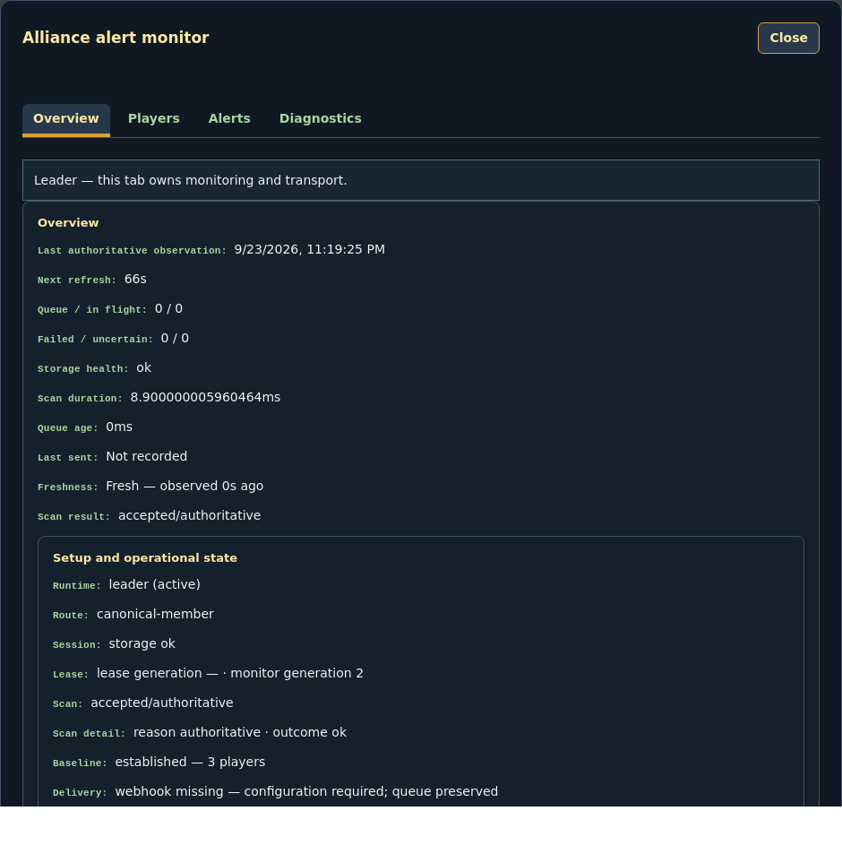

# Travian Attack Alert

Alliance attack, raid, and departure alerts from Travian to your own Discord server. One Tampermonkey userscript, running quietly in your browser tab. No backend, no account, no runtime dependency.

**English** | [Polski](README.pl.md)

<p align="center">
  <a href="https://github.com/PeterPage2115/Travian-Attack-Alert/releases/latest"></a>
  <a href="LICENSE"></a>
  <a href="https://github.com/PeterPage2115/Travian-Attack-Alert/releases/latest/download/travian-attack-alert.user.js"></a>
  <a href="https://github.com/PeterPage2115/Travian-Attack-Alert/actions/workflows/ci.yml"></a>
</p>



*The panel above is rendered from this repository's own synthetic Playwright fixture. No real alliance, player, host, account, or webhook data appears in it.*

## What it does

The script watches the alliance members table on your Travian world and pings your Discord when new attacks, raids, or departures appear. It keeps a delta baseline, so the first accepted scan is silent and only what changed since the previous scan produces alerts. Everything runs locally in your browser tab: the Travian session never leaves your machine, and the Discord webhook lives only in your userscript manager. Current build: `1.0.2` (`taa-1.0.2`).

## Install

1. Install a userscript manager: [Tampermonkey for Chrome](https://chromewebstore.google.com/detail/tampermonkey/dhdgffkkebhmkfjojejmpbldmpobfkfo) or [Tampermonkey for Firefox](https://addons.mozilla.org/firefox/addon/tampermonkey/).
2. Open the installer from the [latest GitHub Release](https://github.com/PeterPage2115/Travian-Attack-Alert/releases/latest) and confirm the Tampermonkey prompt. The one-click asset is [`travian-attack-alert.user.js`](https://github.com/PeterPage2115/Travian-Attack-Alert/releases/latest/download/travian-attack-alert.user.js).
3. On Chrome 138+ with Tampermonkey 5.3+, turn on **Allow User Scripts** (or Developer Mode). Without it the browser runs no userscript at all: no panel, no menu, no scan, no alert. This is Tampermonkey FAQ Q209.
4. Confirm the installed script shows name `Travian Attack Alert`, namespace `travian-attack-alert-public`, and version `1.0.2`.

Updates arrive automatically through the script's `@updateURL` channel on the `release/public-1.0.0` branch, so a manager that honors it pulls the current file without manual work. Reinstalling from the latest release applies a new version too. Never enable two senders at once during an update.

Building from source is for contributors, not for installing the script. See [CONTRIBUTING.md](CONTRIBUTING.md).

## Quick start

1. Open the canonical route: `https://<your-world>.travian.com/alliance/profile/members`. It must be query-free; any other matched route stays inert and never scans.
2. Set the Discord webhook in the **Tampermonkey menu** with `Set Discord webhook URL`. `Show Discord webhook status` tells you whether one is configured.
3. Click **Send TEST alert to Discord** on the Alerts tab (`taa-tab-alerts`). A TEST proves transport only. It never proves the detector and never touches the baseline.
4. Confirm an accepted scan and an established baseline on the Overview tab (`taa-tab-overview`).

If Travian shows a login page, log in first; the monitor never scans or mutates state there. The first accepted scan commits the baseline silently, so old attacks do not flood the channel. Detections made before a webhook is set stay queued instead of being dropped.

## Features

**Detection**
- Watches the alliance members table on the canonical page for new attacks, raids, and departures.
- Delta-based: the first accepted scan sets the baseline silently, then only new events alert.
- Per-player thresholds, mutes, and Normal / High / Critical priority bands.
- Leaving a player never removes Discord access automatically; a moderator must revoke it by hand.

**Discord alerts**
- Sends to your own Discord webhook: no bot, no OAuth app, no backend.
- Delta-first messages with linked player names and one mention pass per batch.
- Delivery is at-least-once, so a lost acknowledgement can duplicate a batch.

**Panel**
- Overview (`taa-tab-overview`) is read-only status; Players (`taa-tab-players`) holds roster, mappings, and mutes.
- Alerts (`taa-tab-alerts`) holds thresholds, roles, and test send; Diagnostics (`taa-tab-diagnostics`) holds traces and exports.

**Safety**
- The webhook lives only in userscript storage (`GM_setValue`) and is never written into code or logs.
- A standby tab without the lease stays read-only, and losing the lease disables mutations immediately.

Deeper reading: [alert format](docs/ALERT-FORMAT.md), [operations](docs/OPERATIONS.md), [architecture](docs/architecture.md).

## Configuration

Daily work lives in the panel. Setup and recovery live in the Tampermonkey menu.

| Where | What |
| --- | --- |
| Panel, Overview (`taa-tab-overview`) | Read-only status: runtime, route, session, lease, scan, baseline, delivery. |
| Panel, Players (`taa-tab-players`) | Alliance roster, per-player mappings, and mutes. |
| Panel, Alerts (`taa-tab-alerts`) | Attack and raid thresholds, priority bands, attack and leave-moderator roles, test send. |
| Panel, Diagnostics (`taa-tab-diagnostics`) | Trace filters and the incident bundle export. |
| Tampermonkey menu | Set, show, or clear the webhook; retry or flush queued batches; toggle debug details; load history and health; import or export settings. |

Common settings and their defaults:

| Setting | Default | Effect |
| --- | --- | --- |
| Attack threshold | 1 | Minimum new attacks on one player before an attack alert. |
| Raid threshold | 1 | Minimum new raids on one player before a raid alert. |
| Normal max | 2 | Peak new count at or below this stays `Priority: Normal`. |
| High max | 5 | Peak at or below this is `Priority: High`; above it is `Priority: Critical`. |

Full operator documentation: [docs/OPERATIONS.md](docs/OPERATIONS.md) (English) and [docs/pl/OPERATIONS.md](docs/pl/OPERATIONS.md) (Polish; the English text governs disagreements).

## How alerts look

Alerts are short and delta-first. The title names the event, the first embed carries the `New`, `Active now`, and `Priority` summary, and the footer is `<hostname> · <observation-text>`.

The full payload contract (field anatomy, mention policy, per-request limits, multi-part splitting, delivery outcomes) is in [`docs/ALERT-FORMAT.md`](docs/ALERT-FORMAT.md). The example below is generated from the live canonical raid builder.

<!-- discord-alert-example:start -->
```text
🛡️ Alliance raid · 2 players
**Players**
[Player 900001](https://world.example.invalid/profile/900001) — **+1 raid**
Now: 0 attacks / 1 raid

[Player 900002](https://world.example.invalid/profile/900002) — **+1 raid**
Now: 0 attacks / 1 raid
New: **+2 raids**
Active now: 0 attacks / 2 raids
Priority: Normal
world.example.invalid · Observed <1s before dispatch
Timestamp: 2026-08-23T09:46:01.000Z
```
<!-- discord-alert-example:end -->

## Privacy & security

- Your Travian session stays in your browser. Credentials are not persisted and cookies are not read.
- The Discord webhook lives only in your userscript manager storage. It is validated as an HTTPS Discord webhook URL, stored without a query string, and never logged or displayed in full.
- Export incident bundle first when something looks wrong: Diagnostics tab, **Export incident bundle** (`taa-incident-bundle-export`). The incident bundle is bounded (512 KiB) and redacted by construction.
- The settings backup (**Export settings** / **Import settings**, collapsed under `taa-settings-details`) is the full-settings restore path: it restores mappings, settings, mutes, names, roster, and roles, and carries the webhook secret only with your explicit opt-in.
- Do not clear site data: the last accepted roster, mappings, and role configuration live in storage, and clearing destroys the only recoverable copies.
- Malformed or partial input never changes state: acquisition is rejected without partial state and the last accepted state remains unchanged.
- All player names, hosts, and tokens in the docs and alert examples are synthetic fixtures. No real player data, hosts, or secrets appear in this repository.

## Troubleshooting

1. Nothing happens at all. On Chrome 138+ enable **Allow User Scripts** (or Developer Mode), reload the page, then reinstall the script.
2. Nothing reaches Discord. Check the Overview Delivery line. If the webhook is missing, set it through the Tampermonkey menu; detections stay queued, nothing is lost.
3. The scan looks wrong. Confirm the exact query-free `/alliance/profile/members` route and that you are logged in. A parser rejection shows `Live roster unavailable` with a reason code.
4. Two installs double-send. Keep exactly one active monitoring installation per alliance and world; a second computer or browser profile is a second sender.
5. Still stuck. Export the redacted incident bundle and follow the diagnostics-first checklist in [docs/OPERATIONS.md](docs/OPERATIONS.md).

## Documentation

- [Docs index](docs/README.md): every current document, with the release-history archive marked historical.
- [Daily operations (English)](docs/OPERATIONS.md) and [Polish](docs/pl/OPERATIONS.md): morning routine, queue recovery, handover, troubleshooting.
- [Alert payload format](docs/ALERT-FORMAT.md): request anatomy, mention policy, per-request limits, splitting, delivery outcomes.
- [Architecture](docs/architecture.md): module graph and design tokens.
- [Owner release runbook](docs/RELEASE-RUNBOOK.md): the ordered, owner-gated publication procedure.
- [Changelog](CHANGELOG.md), [Contributing](CONTRIBUTING.md), [Security policy](SECURITY.md).
- Moving from the internal 6.2.1 line (historical)? Export a settings backup from the old sender, disable it, keep site data, then install 1.0.2. See [docs/MIGRATION-6X.md](docs/MIGRATION-6X.md).

## Support

When reporting a problem, include the script version (`1.0.2`), your browser and userscript manager versions, numbered steps to reproduce, what you expected, and what happened instead. Attach the redacted incident bundle. NEVER include a webhook URL or token, cookies, passwords, raw page HTML, or player data beyond what the bundle already contains in redacted form.

- [Bug report](.github/ISSUE_TEMPLATE/bug_report.yml)
- [Feature request](.github/ISSUE_TEMPLATE/feature_request.yml)
- [Security policy](SECURITY.md): report vulnerabilities privately, never in a public issue.

Support is voluntary and has no influence on features, priorities, or fix timelines. There is no paid tier.

## Contributing

See [CONTRIBUTING.md](CONTRIBUTING.md) for the workflow, tests, backup, and PR checklist. Building from source is for contributors; the release asset above is the supported install path.

## Changelog

[CHANGELOG.md](CHANGELOG.md) tracks the public release line. Published builds live on [GitHub Releases](https://github.com/PeterPage2115/Travian-Attack-Alert/releases).

## License

[MIT](LICENSE).

## Disclaimer

Travian Attack Alert is an unofficial fan tool. It is not affiliated with, endorsed by, or sponsored by Travian Games GmbH. Travian and all related marks belong to their respective owners.

---

This page documents the Tampermonkey **1.0.2** userscript, identified by release ID `taa-1.0.2`. The current published release is [v1.0.2](https://github.com/PeterPage2115/Travian-Attack-Alert/releases/latest).
